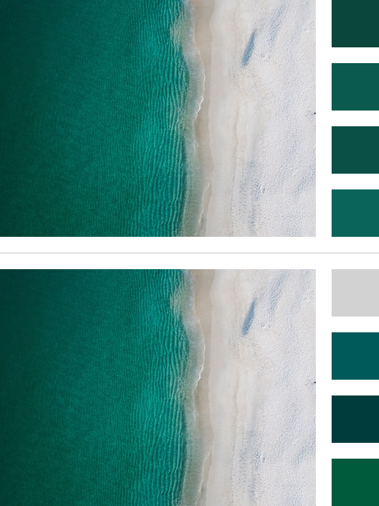

# color.js

Extract colors from an image. Works in the browser and in hybrid environments like Electron. Supports images that are present in the DOM, as well as (external) URL's. Size: ~0.75 KB (min + gzip).

## Installation

```sh
npm install color.js
```

Or directly in the browser:

```html
<script src="https://unpkg.com/color.js@1.0.0/dist/color.js"></script>
```

## Usage example:

```js
import { prominent } from 'color.js'

prominent('js-logo.jpg', { amount: 1 }).then(color => {
  console.log(color) // [241, 221, 63]
})

// Or with different syntax:

const color = await prominent('js-logo.jpg', { amount: 1 })
console.log(color) // [241, 221, 63]
```

When used directly in the browser:

```html
<script src="https://unpkg.com/color.js@1.0.0/dist/color.js"></script>
```

```js
colorjs.prominent('js-logo.jpg', { amount: 1 }).then(color => {
  console.log(color) // [241, 221, 63]
})
```

## API

### Prominent

Returns the most used color(s) in an image. Can be requested as a single color or palette of colors (see [amount](#amount)).

```js
import { prominent } from 'color.js'

prominent('image.jpg').then(colors => ...)
```


### Average

Returns the average color of an image.

```js
import { average } from 'color.js'

average('image.jpg').then(color => ...)
```


## Options

You can pass two arguments, an image and a [configuration](#configuration-optional) `object`.

### Image (required)

Can be a URL or DOM element.

```js
average('image.jpg')
```

```js
const img = document.getElementById('image')
average(img)
```

```js
average('https://example.com/image.jpg')
```

When using an external image, [CORS](https://enable-cors.org/) should of course be enabled on the source.

### Configuration (optional)

The default options. Explanations of each option can be found below.

```js
{
  amount: 3,
  format: 'array',
  group: 20,
  sample: 10,
}
```

#### Amount

Only applicable for [prominent](#prominent).

The amount of colors that should be returned. When set to `1` a singular value is returned, otherwise an `array` of values.

#### Format

The format in which colors should be returned. Options are `'array'` (default) and `'hex'`.

```js
[241, 221, 63] // 'array'
'#f1dd3f' // 'hex'
```

#### Group

Configures how many similar colors should be combined into one color. A value of `1` would mean _every_ individual color would be considered, but this is often not ideal. Especially in photographs there's usually a lot of color data, and grouping colors could give more usable results. In the first example below, `group` is set to `5` and a lot of individual colors in the sea are returned. When more grouping is applied (`30` in the second example), the results become more distinct.



#### Sample

Configures how many pixels of an image should be processed. For example, a value of `20` means every 20th pixel is interpreted. A higher value means less accurate results, but better performance. An example of default sampling (`10`) on an image:


## Browser support

Pretty much everything (> 0.2%), except for IE.
